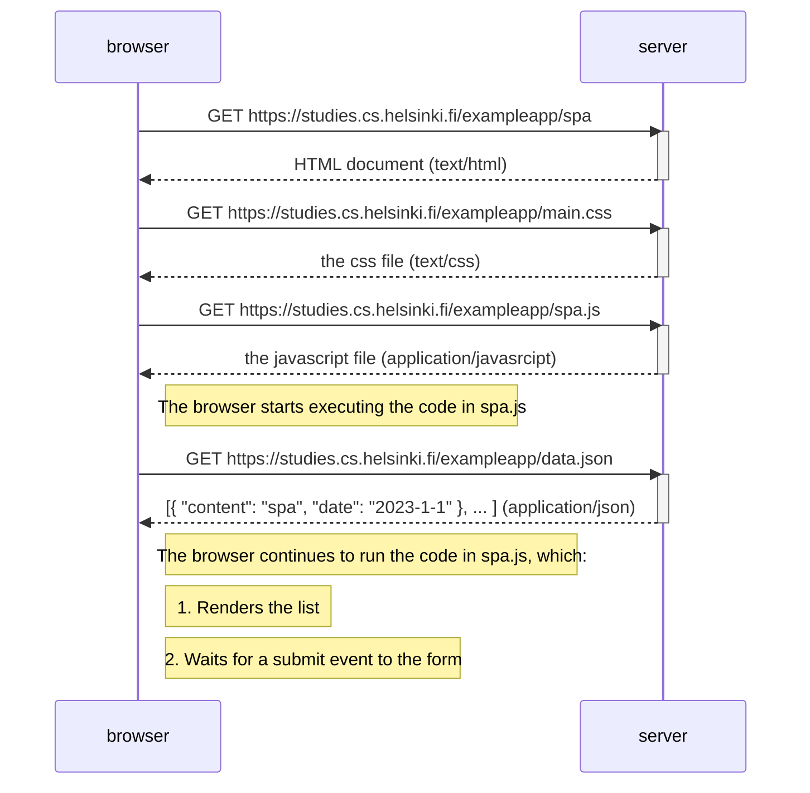

```mermaid
sequenceDiagram
  participant browser
  participant server

  browser->>server: GET https://studies.cs.helsinki.fi/exampleapp/spa
  activate server
  server-->>browser: HTML document (text/html)
  deactivate server

  browser->>server: GET https://studies.cs.helsinki.fi/exampleapp/main.css
  activate server
  server-->>browser: the css file (text/css)
  deactivate server

  browser->>server: GET https://studies.cs.helsinki.fi/exampleapp/spa.js
  activate server
  server-->>browser: the javascript file (application/javasrcipt)
  deactivate server

  Note right of browser: The browser starts executing the code in spa.js

  browser->>server: GET https://studies.cs.helsinki.fi/exampleapp/data.json
  activate server
  server-->>browser: [{ "content": "spa", "date": "2023-1-1" }, ... ] (application/json)
  deactivate server

  Note right of browser: The browser continues to run the code in spa.js, which:
  Note right of browser: 1. Renders the list
  Note right of browser: 2. Waits for a submit event to the form
```
