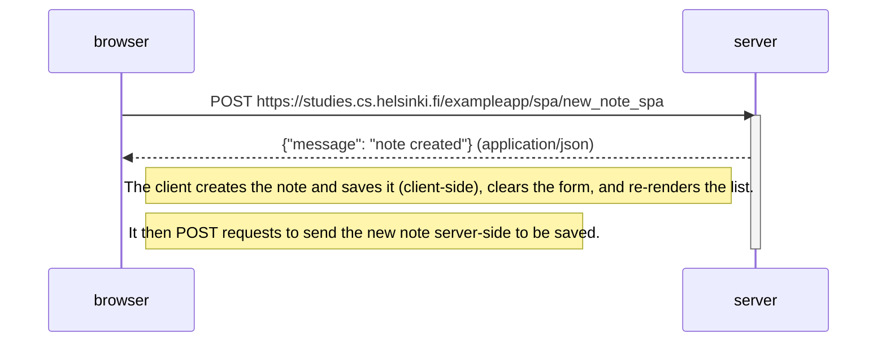

```mermaid
sequenceDiagram
  participant browser
  participant server

  browser->>server: POST https://studies.cs.helsinki.fi/exampleapp/spa/new_note_spa
  activate server
  server-->>browser: {"message": "note created"} (application/json)
  Note right of browser: The client creates the note and saves it (client-side), clears the form, and re-renders the list.
  Note right of browser: It then POST requests to send the new note server-side to be saved.
  deactivate server
```
